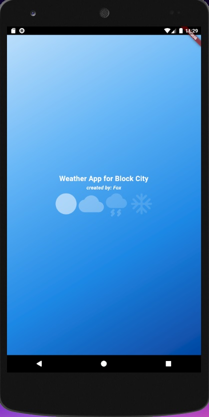
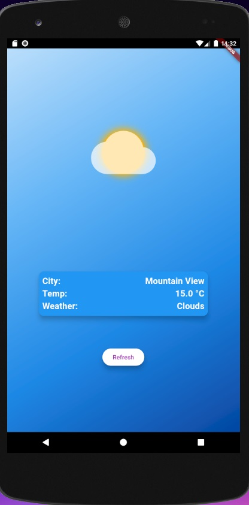
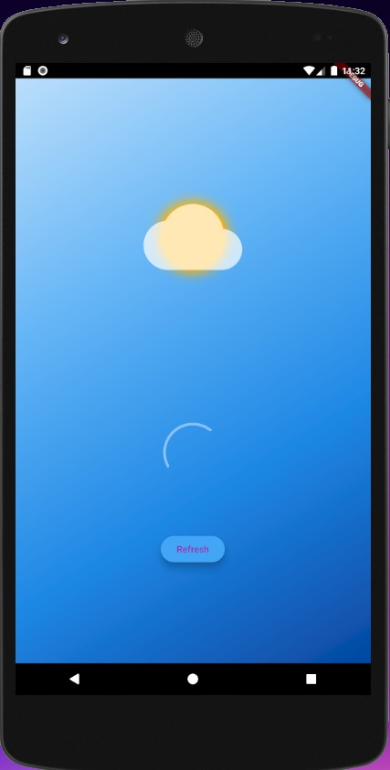
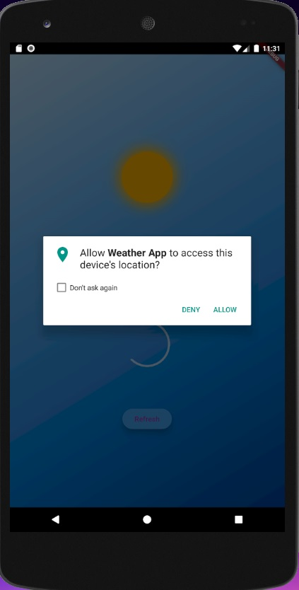

# block_city

An exam Flutter based application created on live coding session.

## Description:
This application is a simple local weather shower app.
The app use MVVM with cubit/bloc and clean architecture rules.
The app has responsive UI.

# Images from the result app on emulator:

